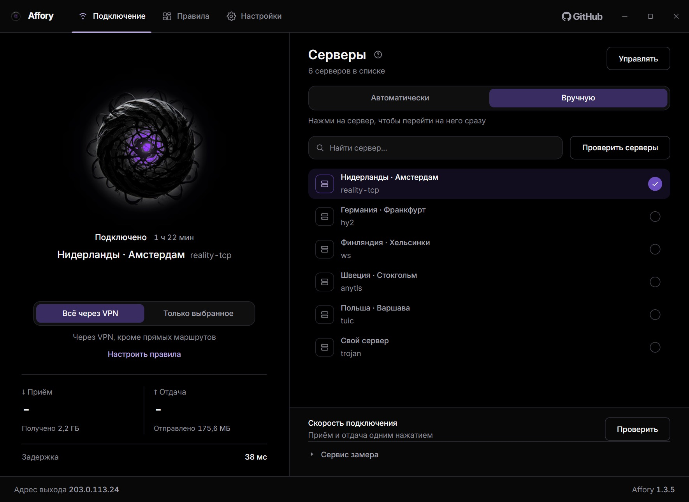
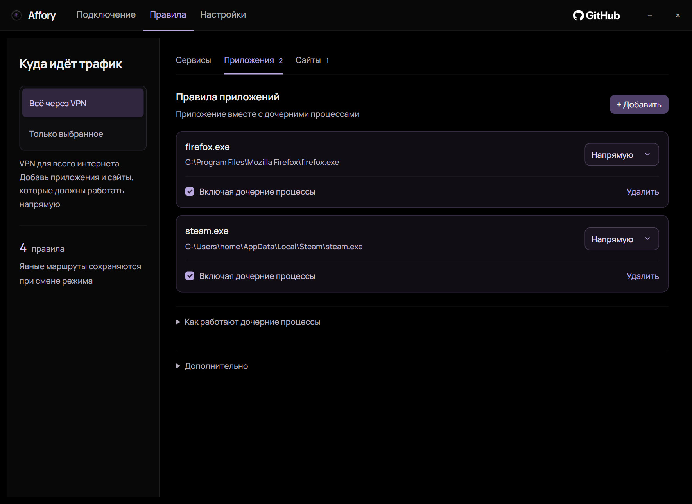
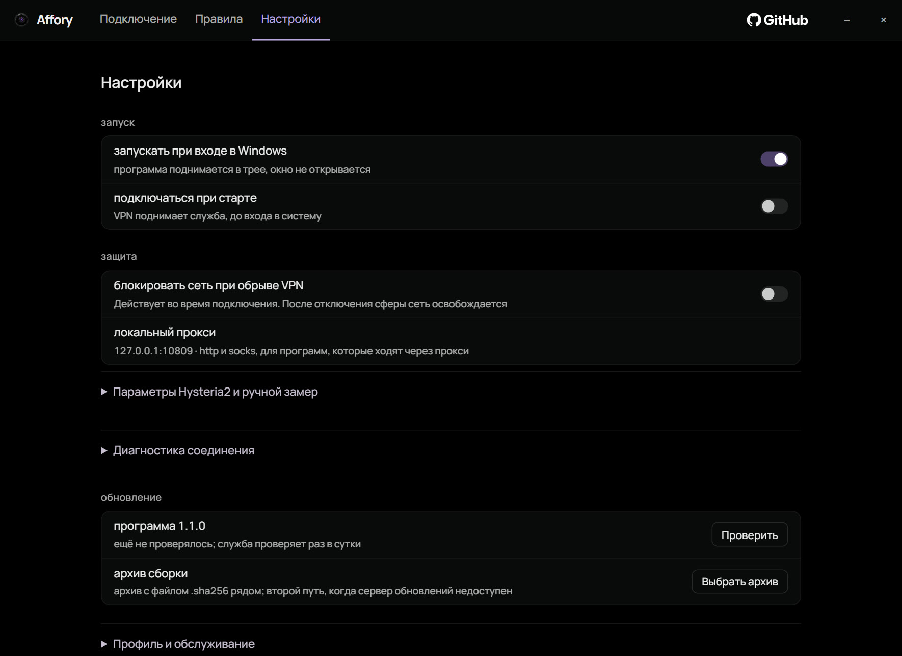

  

<h1 align="center">Affory</h1>

VPN-клиент для Windows с правилами для приложений и сайтов.

  <a href="https://github.com/zxczxczxczxczxczxc1111/affory/releases/latest">Скачать</a> ·
  <a href="https://github.com/zxczxczxczxczxczxc1111/affory/issues">Сообщить об ошибке</a> ·
  <a href="LICENSE">GPL-3.0</a>

Windows 10 / 11 · x64 · Русский интерфейс

  
   Подключение и выбор сервера. Демонстрационные данные: серверы и замеры показаны для примера.

## Что умеет

- Направлять через VPN весь трафик или только выбранные приложения и сайты.
- Выбирать сервер автоматически или подключаться к выбранному вручную.
- Добавлять правила для приложений вместе с дочерними процессами. Приложение можно выбрать из запущенных или найти на компьютере.
- Включать VPN для YouTube, Discord, ChatGPT, Claude и других сервисов одним переключателем.
- Открывать российские сайты напрямую.
- Измерять скорость приёма и отдачи. Если сервис замера недоступен, клиент пробует следующий.
- Работать в трее, подключаться при запуске и блокировать сеть при обрыве VPN, если включена эта настройка. В трее видно доступное обновление.
- Вести журнал соединений для разбора проблем со связью. Выключен по умолчанию, включается в разделе «Правила».

<table>
  <tr>
    <td width="50%"></td>
    <td width="50%"></td>
  </tr>
  <tr><td align="center">Правила приложений</td><td align="center">Настройки</td></tr>
</table>

## Как начать

Для подключения понадобится ссылка на свой VPN-сервер или подписка от провайдера.

1. Скачай **Affory-1.2.0-setup.exe** из [релизов](https://github.com/zxczxczxczxczxczxc1111/affory/releases/latest) и установи. Windows запросит права администратора.
2. Открой Affory, нажми **«Управлять»** и добавь ссылку на сервер или подписку.
3. Нажми на сферу, чтобы подключиться. Она же выключает VPN. Справа переключается автоматический и ручной выбор сервера.

Подписок можно хранить несколько: работает та, что помечена **«активна»**, остальные лежат про запас. Клиент обновляет все раз в 12 часов, поэтому переключение между ними мгновенное и работает, даже когда панель не отвечает.

Чтобы направить через VPN только несколько приложений или сайтов, выбери **«Только выбранное»** и добавь их в разделе **«Правила»**. Там три вкладки: готовые наборы сервисов, приложения и сайты. Счётчик у вкладки показывает, что на ней включено.

## Что стоит знать

Правила начинают действовать после подключения. Если нужны прямые маршруты, оставь настройку **«Блокировать сеть при обрыве VPN»** выключенной: она запрещает соединения мимо VPN.

Установщик подписан самоподписанным сертификатом. Windows может показать предупреждение о неизвестном издателе.

Нашёл ошибку или хочешь предложить изменение? [Напиши в Issues](https://github.com/zxczxczxczxczxczxc1111/affory/issues).

Лицензия [GPL-3.0-or-later](LICENSE). Внутри используется [sing-box](https://github.com/SagerNet/sing-box). Сведения о шрифте, иконках и других компонентах находятся в [THIRD_PARTY_NOTICES.txt](THIRD_PARTY_NOTICES.txt).

