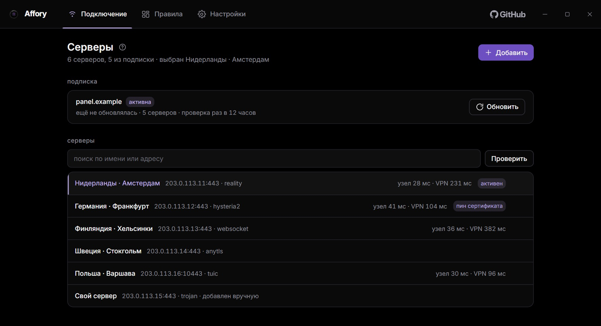
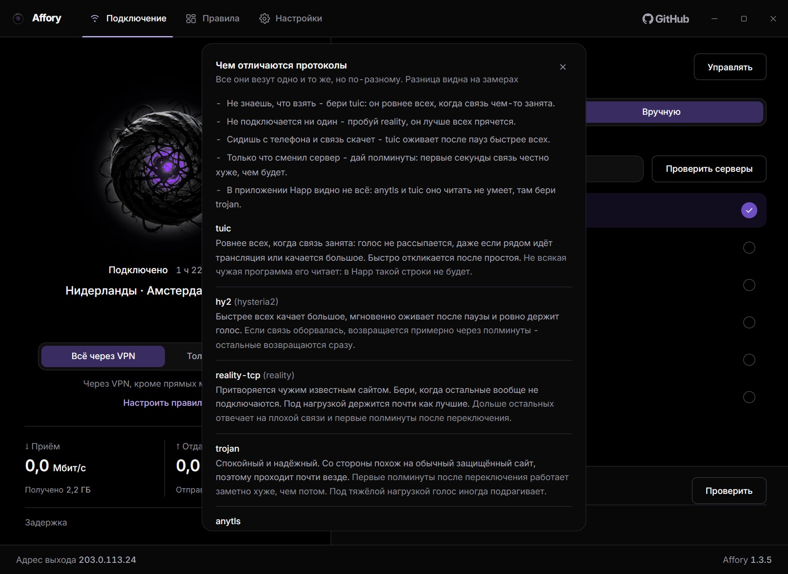
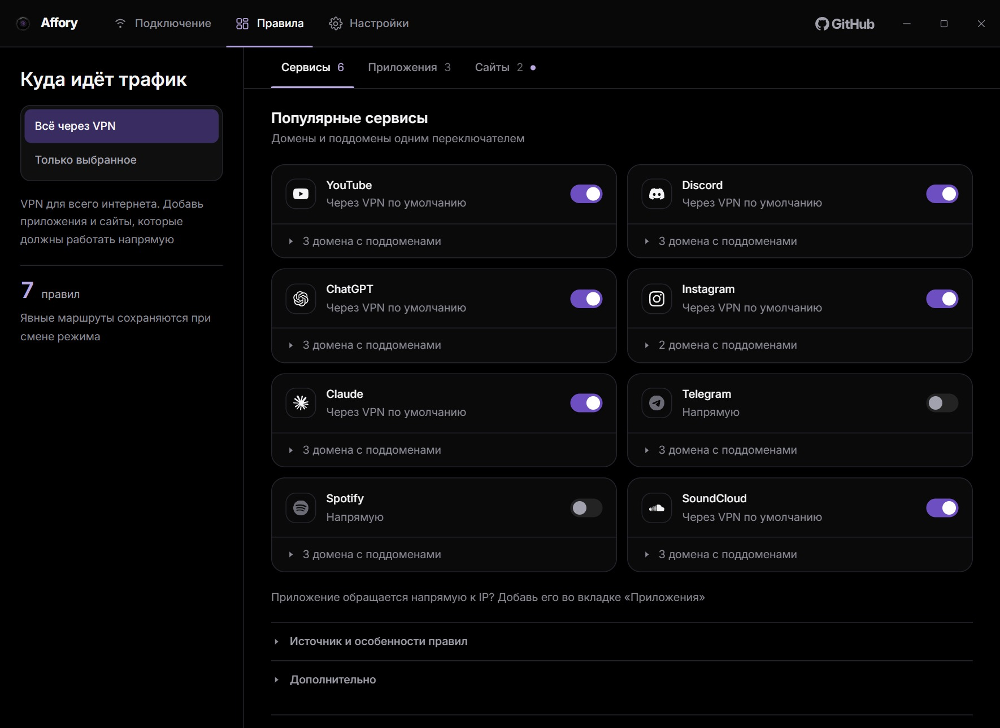
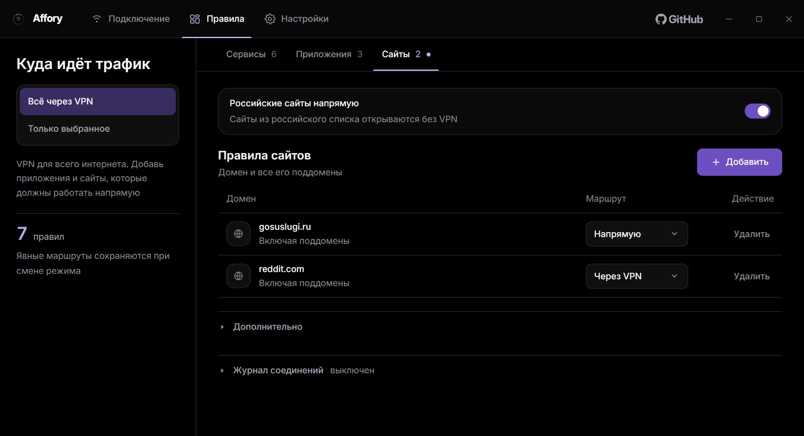

  

<h1 align="center">Affory</h1>

VPN-клиент для Windows с правилами для приложений и сайтов.

  <a href="https://github.com/zxczxczxczxczxczxc1111/affory/releases/latest">Скачать</a> ·
  <a href="https://github.com/zxczxczxczxczxczxc1111/affory/issues">Сообщить об ошибке</a> ·
  <a href="LICENSE">GPL-3.0</a>

Windows 10 / 11 · x64 · Русский интерфейс

  
   Сфера включает и выключает VPN, справа набор серверов. Демонстрационные данные: серверы, адреса и замеры показаны для примера.

## Что умеет

- Направлять через VPN весь трафик или только выбранные приложения и сайты.
- Выбирать сервер автоматически или подключаться к выбранному вручную.
- Добавлять правила для приложений вместе с дочерними процессами. Приложение можно выбрать из запущенных или найти на компьютере.
- Включать VPN для YouTube, Discord, ChatGPT, Claude и других сервисов одним переключателем.
- Открывать российские сайты напрямую.
- Измерять скорость приёма и отдачи. Если сервис замера недоступен, клиент пробует следующий.
- Показывать задержку: под сферой один круг до интернета через VPN - то же число, что пинг в играх и в Discord.
- Проверять серверы до подключения: до узла и через VPN, двумя отдельными числами.
- Объяснять, чем отличаются протоколы, словами и по замерам: справка открывается значком у заголовка «Серверы».
- Добавлять сервер или подписку ссылкой, из буфера обмена или чтением QR прямо с экрана.
- Хранить несколько подписок и переключаться между ними мгновенно.
- Проверять соединение на утечки и показывать адрес выхода. Диагностика ничего не меняет, только смотрит.
- Работать в трее, подключаться при запуске и блокировать сеть при обрыве VPN, если включена эта настройка. В трее видно доступное обновление.
- Вести журнал соединений для разбора проблем со связью. Выключен по умолчанию, включается в разделе «Правила».

## Экраны

<table>
  <tr>
    <td width="50%"></td>
    <td width="50%"></td>
  </tr>
  <tr>
    <td align="center"><b>Серверы и подписки</b> Задержка до узла и через VPN по каждому серверу</td>
    <td align="center"><b>Чем отличаются протоколы</b> Что даёт каждый и чем платит, по замерам</td>
  </tr>
  <tr>
    <td></td>
    <td></td>
  </tr>
  <tr>
    <td align="center"><b>Сервисы</b> Домены и поддомены одним переключателем</td>
    <td align="center"><b>Приложения</b> Маршрут для программы и её потомков</td>
  </tr>
  <tr>
    <td></td>
    <td></td>
  </tr>
  <tr>
    <td align="center"><b>Сайты</b> Домен со всеми поддоменами, российский список отдельно</td>
    <td align="center"><b>Настройки</b> Запуск, защита, диагностика и обновление</td>
  </tr>
</table>

## Как начать

Для подключения понадобится ссылка на свой VPN-сервер или подписка от провайдера.

1. Скачай установщик `Affory-<версия>-setup.exe` из [релизов](https://github.com/zxczxczxczxczxczxc1111/affory/releases/latest) и установи. Windows запросит права администратора.
2. Открой Affory, нажми **«Управлять»** и добавь ссылку на сервер или подписку. Ссылку можно вставить, взять из буфера обмена или прочитать с экрана: **«QR с экрана»** прячет окно, снимает экраны и находит код. Годится и ключ, и адрес подписки.
3. Нажми на сферу, чтобы подключиться. Она же выключает VPN. Справа переключается автоматический и ручной выбор сервера.

Подписок можно хранить несколько: работает та, что помечена **«активна»**, остальные лежат про запас. Клиент обновляет все раз в 12 часов, поэтому переключение между ними мгновенное и работает, даже когда панель не отвечает.

Чтобы направить через VPN только несколько приложений или сайтов, выбери **«Только выбранное»** и добавь их в разделе **«Правила»**. Там три вкладки: готовые наборы сервисов, приложения и сайты. Счётчик у вкладки показывает, что на ней включено.

## Что стоит знать

Правила начинают действовать после подключения. Если нужны прямые маршруты, оставь настройку **«Блокировать сеть при обрыве VPN»** выключенной: она запрещает соединения мимо VPN.

Задержка под сферой и задержка в списке серверов отвечают на разные вопросы, поэтому числа разные. Под сферой один круг до интернета по уже поднятому соединению. В списке рядом с сервером два числа: **узел** это дорога до сервера мимо VPN, **VPN** это весь запрос через него вместе с рукопожатием, и он всегда больше.

Первые полминуты после смены сервера связь честно хуже, чем будет: протоколы поверх TCP выходят на режим не сразу. Справка о протоколах говорит, какой из них что даёт.

Обновления клиент проверяет сам и ставит по кнопке в настройках. Если сервер обновлений недоступен, там же можно выбрать скачанный архив `affory-<версия>.zip` — файл `.sha256` должен лежать рядом, клиент сверяет его перед установкой.

Установщик подписан самоподписанным сертификатом. Windows может показать предупреждение о неизвестном издателе.

Нашёл ошибку или хочешь предложить изменение? [Напиши в Issues](https://github.com/zxczxczxczxczxczxc1111/affory/issues).

Лицензия [GPL-3.0-or-later](LICENSE). Внутри используется [sing-box](https://github.com/SagerNet/sing-box). Сведения о шрифте, иконках и других компонентах находятся в [THIRD_PARTY_NOTICES.txt](THIRD_PARTY_NOTICES.txt).
