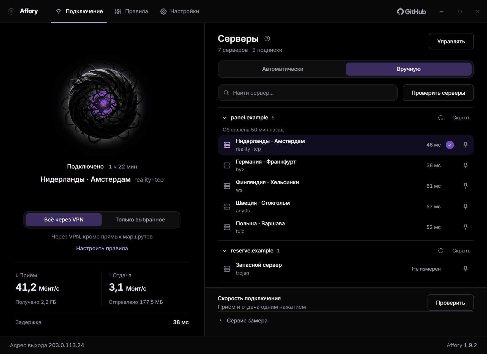
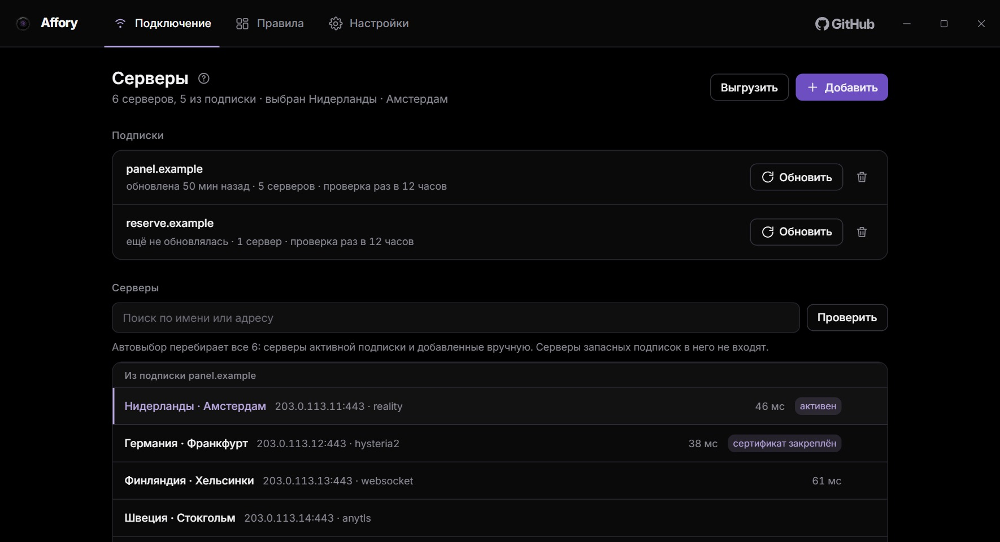
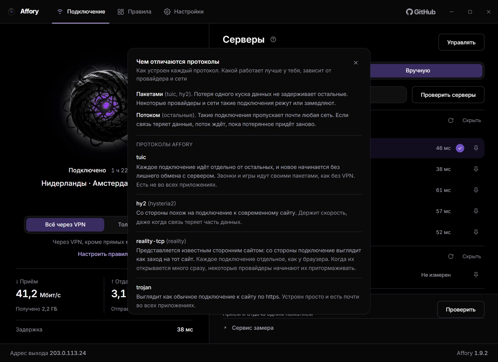
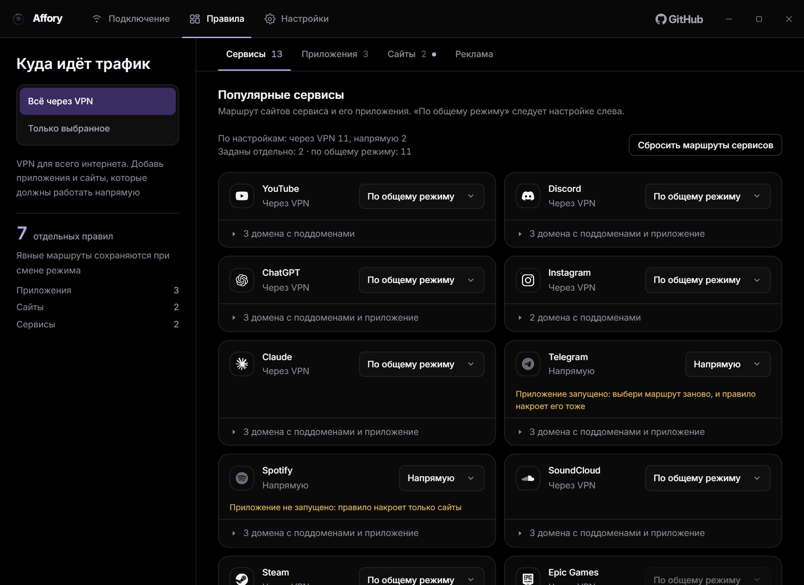
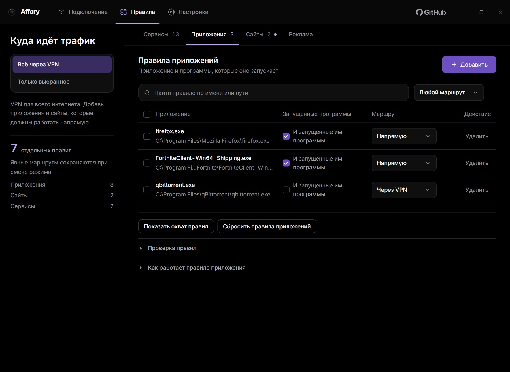
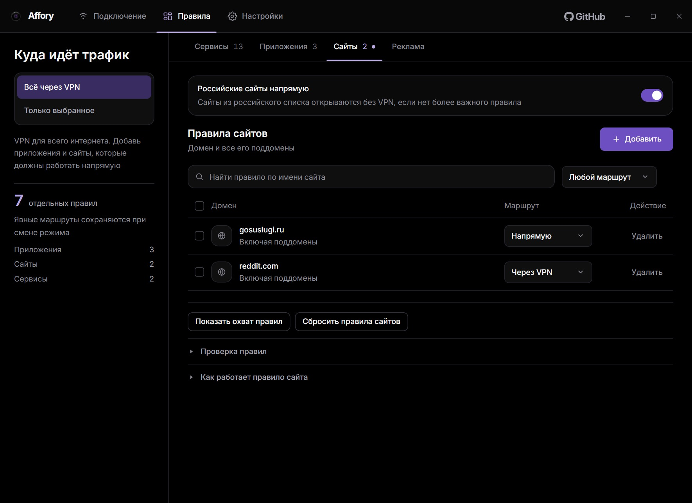
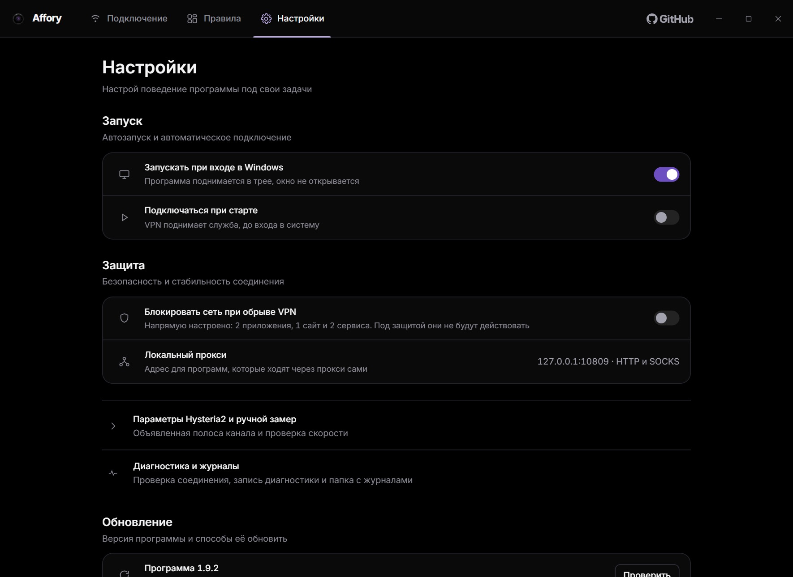

<p align="center">
  
</p>
<h1 align="center">Affory</h1>
<p align="center">VPN-клиент для Windows: весь трафик через VPN или только выбранные приложения и сайты</p>
<p align="center">
  <a href="https://github.com/zxczxczxczxczxczxc1111/affory/releases/latest"><b>Скачать</b></a> ·
  <a href="https://github.com/zxczxczxczxczxczxc1111/affory/issues">Сообщить об ошибке</a> ·
  <a href="LICENSE">GPL-3.0</a>
</p>
<p align="center"><sub>Windows 10 и 11 · x64 · русский интерфейс</sub></p>

<p align="center">
  <a href="assets/screenshots/connection.jpg"></a>
  <br><sub>Сфера включает и выключает VPN, справа серверы по подпискам. Данные на снимках демонстрационные</sub>
</p>

## Установка

Понадобится ключ своего VPN-сервера или подписка от провайдера.

1. Скачай `Affory-<версия>-setup.exe` со страницы [последнего выпуска](https://github.com/zxczxczxczxczxczxc1111/affory/releases/latest) и запусти. Установщик попросит права администратора, дальше программа работает без них.
2. В окне Affory нажми **«Управлять»** и вставь ключ или адрес подписки. Их можно взять кнопкой **«из буфера»** или считать с экрана кнопкой **«QR с экрана»**: Affory покажет найденное и добавит его после подтверждения.
3. Нажми на сферу, чтобы подключиться. Второе нажатие отключает VPN.

Установщик подписан самоподписанным сертификатом, поэтому Windows может предупредить о неизвестном издателе. Сверить файл с выпуском помогут суммы SHA-256, см. «Проверка файлов выпуска» ниже.

## Возможности

- Весь трафик через VPN или только выбранное: приложения вместе с программами, которые они запускают, сайты со всеми поддоменами, готовые наборы для YouTube, Discord, ChatGPT, Claude, Telegram, Steam и других сервисов
- Российские сайты напрямую одним переключателем
- Блокировка рекламы и трекеров списками HaGeZi для всего компьютера, с исключениями, по умолчанию выключена
- Несколько подписок: все обновляются раз в 12 часов, и на сервер запасной подписки можно перейти, даже когда её панель не отвечает
- Автоматический или ручной выбор сервера, пинг каждого сервера одним числом, как в играх и Discord
- На экране «Управлять» кнопка **«Выгрузить»** отдаёт ключи списком по серверам, у каждого свои «Скопировать» и QR, а в меню правой кнопки на сервере есть **«Скопировать ключ»** и **«Показать ключ и QR»**
- Если DNS провайдера не отдаёт адрес сервера или подписки, Affory спрашивает публичный DNS Google и Cloudflare через HTTPS
- Блокировка сети при обрыве VPN, запуск в трее при входе в Windows, подключение до входа в систему
- Замер скорости, проверка утечек и адреса выхода, проверка сети по частям: VPN, сервер, имена сайтов, голос и видео
- Обновление одной кнопкой, о новой версии напоминают трей и главный экран
- Диагностика одним файлом без ключей для сообщения об ошибке

## Подробнее

<details>
<summary>Экраны</summary>

<table>
  <tr>
    <td width="50%"><a href="assets/screenshots/servers.jpg"></a></td>
    <td width="50%"><a href="assets/screenshots/protocols.jpg"></a></td>
  </tr>
  <tr>
    <td align="center"><b>Серверы и подписки</b><br><sub>Подписки, ручные серверы и выгрузка ключей</sub></td>
    <td align="center"><b>Чем отличаются протоколы</b><br><sub>Справка у заголовка «Серверы»</sub></td>
  </tr>
  <tr>
    <td><a href="assets/screenshots/services.jpg"></a></td>
    <td><a href="assets/screenshots/applications.jpg"></a></td>
  </tr>
  <tr>
    <td align="center"><b>Сервисы</b><br><sub>Маршрут для сайтов и приложения сервиса</sub></td>
    <td align="center"><b>Приложения</b><br><sub>Маршрут для программы и всего, что она запускает</sub></td>
  </tr>
  <tr>
    <td><a href="assets/screenshots/sites.jpg"></a></td>
    <td><a href="assets/screenshots/settings.jpg"></a></td>
  </tr>
  <tr>
    <td align="center"><b>Сайты</b><br><sub>Домен со всеми поддоменами, российский список отдельно</sub></td>
    <td align="center"><b>Настройки</b><br><sub>Запуск, защита, диагностика и обновление</sub></td>
  </tr>
</table>

</details>

<details>
<summary>Протоколы и ссылки</summary>

- **VLESS** (`vless://`): Reality поверх TCP или gRPC, TLS поверх TCP с Vision и без, WebSocket, gRPC и HTTPUpgrade с TLS или без
- **Hysteria2** (`hy2://`, `hysteria2://`), **TUIC** (`tuic://`), **AnyTLS** (`anytls://`)
- **Trojan** (`trojan://`) и **VMess** (`vmess://`) поверх TCP или WebSocket
- **Shadowsocks** (`ss://`): SIP002 и прежняя форма ссылки

Ключи вставляй по одному на строку или одним блоком base64. Подписка это адрес, по которому панель отдаёт такой же список. Affory обновляет её раз в 12 часов и по кнопке «Обновить», а строки, которые не разобрал, показывает с номером и причиной.

Панели подписки Affory сообщает свою версию, версию и модель Windows и хеш номера машины, свой для каждого адреса подписки. Номер нужен панелям с лимитом устройств.

Чем протоколы отличаются друг от друга, объясняет справка: значок «?» у заголовка «Серверы».

Для Hysteria2 в «Настройках» можно объявить полосу своего канала, это включает режим Brutal. Полосу лучше измерить там же: завышенная ухудшает соединение.

</details>

<details>
<summary>Как работают правила</summary>

Режим выбирается на главном экране и в «Правилах»:

- **«Всё через VPN»**: трафик идёт через VPN, кроме правил с маршрутом «Напрямую»
- **«Только выбранное»**: интернет напрямую, через VPN идёт только то, что есть в правилах

У каждого правила свой маршрут, «Через VPN» или «Напрямую». Вкладки «Правил»:

- **Сервисы**: сайты сервиса и его приложение одним выбором. «По общему режиму» следует режиму слева
- **Приложения**: программа из запущенных или выбранная на диске. С флажком «И запущенные им программы» правило действует и на дочерние процессы, если Affory заметил их запуск
- **Сайты**: домен со всеми поддоменами и переключатель «Российские сайты напрямую»
- **Реклама**: блокировка рекламы и трекеров, базовый или расширенный список и исключения «Не блокировать»

Первым действует правило приложения, затем сайта, затем сервиса, а более точный домен важнее общего. Правки копятся в черновике до кнопки «Применить изменения». При подключённом VPN это одно короткое переподключение.

Пока включена «Блокировать сеть при обрыве VPN», весь трафик идёт через VPN, а правила «Напрямую» ждут её выключения.

Программам, которые умеют ходить через прокси, Affory даёт локальный прокси HTTP и SOCKS на `127.0.0.1`. Он поднимается вместе с VPN, адрес в «Настройках», раздел «Защита».

</details>

<details>
<summary>Частые вопросы</summary>

**Windows предупреждает о неизвестном издателе.** Установщик подписан самоподписанным сертификатом, SmartScreen его не знает. Сверь сумму файла с выпуском, как описано в «Проверке файлов выпуска».

**Задержка и пинг серверов.** «Задержка» под сферой это один круг до интернета через VPN, то же, что пинг в играх и Discord. Пинг в списке серверов Affory меряет так же для каждого сервера и берёт лучший из трёх кругов. «Проверить серверы» работает и без подключения.

**Правила «Напрямую» не действуют.** Проверь «Настройки» → «Защита»: при включённой «Блокировать сеть при обрыве VPN» весь трафик идёт через VPN.

**Реклама на YouTube осталась.** Блокировка смотрит на имена сайтов, а YouTube и Twitch отдают рекламу со своих же адресов. Браузер с вручную включённым защищённым DNS тоже обходит список.

**После отключения пропал интернет.** В папке программы лежит `ESLI-NET-INTERNETA.txt` с командами, которые снимают защиту Affory и возвращают прежние настройки брандмауэра.

**Обновление.** Affory раз в сутки проверяет последний выпуск на GitHub. Новую версию ставит кнопка «Установить» в «Настройках» → «Обновление», туда же ведут пункт трея и плашка «Есть версия …» на главном экране. Если новая версия не поднимется за 20 секунд, останется прежняя.

**GitHub недоступен.** Скачай `affory-<версия>.zip` и `affory-<версия>.zip.sha256`, положи в одну папку и выбери архив в «Настройках» → «Обновление» → «Архив сборки». Для этого нужны права администратора.

**Перенос на другой компьютер.** «Настройки» → «Профиль и обслуживание» → «Вывести профиль» сохраняет серверы, подписки и правила одним файлом под паролем. На новом компьютере открой тот же раздел и нажми «Ввести». Ключи для телефона отдаёт кнопка «Выгрузить» на экране «Управлять».

**Удаление.** «Настройки» → «Профиль и обслуживание» → «Удалить программу» или ярлык «Удалить Affory» в меню «Пуск». По умолчанию ключи остаются для следующей установки, стереть их можно в том же диалоге.

</details>

<details>
<summary>Где лежат данные и журналы</summary>

| Что | Где |
|---|---|
| Программа | `C:\Program Files\Affory` или папка, выбранная при установке |
| Ключи, подписки, правила | `C:\ProgramData\Affory`, ключи зашифрованы средствами Windows (DPAPI), папку читают только система и администраторы |
| Журналы | `C:\ProgramData\Affory\log`, читать может любой пользователь компьютера |

В папке журналов: `sluzhba.log` служба, `yadro.log` ядро sing-box, `komandy.log` команды окна и консоли, `obnovlenie.log` и `ustanovka.log`. Ключей в них нет.

Ещё два журнала включаются в «Настройки» → «Диагностика и журналы», по умолчанию оба выключены:

- **Журнал соединений** (`C:\ProgramData\Affory\soedineniya.jsonl`): приложение, адрес и маршрут каждого соединения, чтобы проверить правила
- **Подробный журнал для отладки** (`C:\ProgramData\Affory\log\diagnostika.jsonl`): порты, соединения, скорость и задержка раз в секунду, когда связь нестабильна

К сообщению об ошибке приложи файл из «Диагностика одним файлом» → «Сохранить» в том же разделе: журналы службы без ключей и адресов подписок.

</details>

<details>
<summary>Консоль affory-cli</summary>

`affory-cli.exe` лежит в папке программы и управляет той же службой, что и окно. Флаги ставятся после команды, идентификаторы печатают `servers list` и `subscription list`.

```text
affory-cli status
affory-cli connect [--server <id>]
affory-cli disconnect
affory-cli switch <id>                 сменить сервер на живом подключении
affory-cli mode [avto|ruchnoy]         выбор сервера; без аргумента печатает текущий
affory-cli killswitch on|off           блокировка сети при обрыве VPN
affory-cli servers list
affory-cli servers add <ссылка>
affory-cli servers remove <id>
affory-cli subscription list
affory-cli subscription add <адрес>
affory-cli subscription use <id>
affory-cli subscription remove <id>
affory-cli subscription refresh
affory-cli rules list
affory-cli autostart on|off            окно в трее при входе в Windows
affory-cli autoconnect on|off          подключение при старте службы
affory-cli journal on|off|clear        журнал соединений
affory-cli diagnostics on|off          подробный журнал для отладки
affory-cli profile export --out <файл>
affory-cli profile import --in <файл>
affory-cli events [--seconds N]        события службы
affory-cli version
```

Пароль профиля консоль спрашивает в терминале. Ссылки и адреса подписок из аргументов остаются в истории оболочки, консоль об этом предупреждает.

</details>

<details>
<summary>Проверка файлов выпуска</summary>

Рядом с установщиком и архивом обновления на странице выпуска лежат файлы `.sha256`. Скачай оба в одну папку и выполни там в PowerShell:

```powershell
$f = 'Affory-1.9.2-setup.exe'
(Get-FileHash $f -Algorithm SHA256).Hash -eq (Get-Content "$f.sha256").Split(' ')[0]
```

`True` значит, что файл совпадает с выпущенным. Номер версии подставь свой.

Исходники выпуска приложены к нему архивом `Affory-<версия>-sources.zip`.

</details>

<details>
<summary>Как устроен Affory</summary>

- **AfforySvc** (`affory-svc.exe`, Go): служба Windows. Хранит ключи, собирает конфиг ядра, поднимает туннель, ставит правила брандмауэра для блокировки сети и проверяет обновления
- **Окно** (`affory-ui.exe`): Wails 3, React и TypeScript, работает с правами обычного пользователя
- **Консоль** (`affory-cli.exe`): команды службы из терминала
- **Ядро** (`sing-box.exe`): sing-box с правилом для процесса и его потомков, трафик идёт через TUN-адаптер

Окно и консоль говорят со службой по именованному каналу. Права администратора нужны установке и обновлению из архива с диска.

Код: `cmd/affory-svc`, `cmd/affory-ui` (интерфейс в `cmd/affory-ui/frontend`), `cmd/affory-cli`, общие пакеты в `internal`, установщик и сборка ядра в `ustanovka`.

</details>

<details>
<summary>Сборка из исходников</summary>

Нужны Go (версию задаёт строка `toolchain` в `go.mod`) и Node.js с npm.

```powershell
cd cmd\affory-ui\frontend
npm ci
npm run build
cd ..\..\..
go build -o affory-svc.exe ./cmd/affory-svc
go build -o affory-cli.exe ./cmd/affory-cli
go build -tags production -ldflags "-H windowsgui" -o affory-ui.exe ./cmd/affory-ui
```

Ядро собирает `ustanovka\sobrat-yadro.ps1`, ему нужны git и Go. Скрипт берёт sing-box нужной версии и накладывает патчи из `ustanovka\patches`. Что они меняют и как повторить сборку, описано в [`ustanovka/YADRO-ISHODNIKI.txt`](ustanovka/YADRO-ISHODNIKI.txt).

</details>

<details>
<summary>Лицензии</summary>

Affory распространяется под [GPL-3.0-or-later](LICENSE). Ядро это сборка [sing-box](https://github.com/SagerNet/sing-box) (GPL-3.0-or-later) с патчами из `ustanovka/patches`. Каталог сервисов собран из [OpenCCK](https://github.com/rekryt/iplist) (MIT), списки рекламы из [HaGeZi DNS Blocklists](https://github.com/hagezi/dns-blocklists) (GPL-3.0), шрифт [Inter](https://github.com/rsms/inter) под SIL OFL 1.1, значки сервисов из [Simple Icons](https://github.com/simple-icons/simple-icons) (CC0). Подробности в [THIRD_PARTY_NOTICES.txt](THIRD_PARTY_NOTICES.txt).

</details>

Нашёл ошибку или хочешь предложить изменение, пиши в [Issues](https://github.com/zxczxczxczxczxczxc1111/affory/issues). Об уязвимости сообщай приватно, как описано в [SECURITY.md](SECURITY.md).
